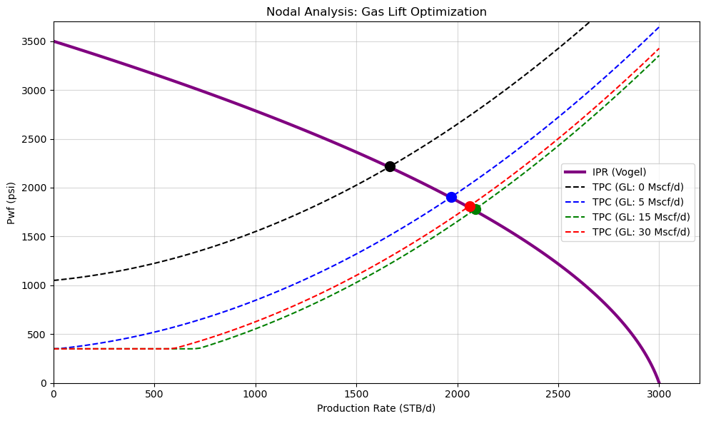

# Nodal-Analysis
Constructed a computational nodal Gas Lift Nodal Analysis & Surface Compression

This project bridges the gap between wellbore performance and surface facility limits. I built this to model a complete artificial lift system using Python to find the optimal gas lift injection rate, and DWSIM to prove the surface equipment can actually handle the resulting gas volumes. 

**Wellbore Optimization (Python)**
The first step was writing a nodal analysis script to calculate the intersection of the Vogel IPR and empirical tubing performance curves. The script runs a sensitivity analysis on various gas lift injection rates, allowing us to pinpoint the exact operating point for maximum liquid recovery without choking the well.

**Surface Facility Integration (DWSIM)**
To ensure thermodynamic consistency between the well and the surface, the Python script exports the fluid composition and pressure boundaries directly to CSV. 

Using that data, I built a 3-stage centrifugal compressor train in DWSIM using the Peng-Robinson equation of state. The model takes the 50 psig suction gas and boosts it to a final discharge of 2500 psig. I included interstage coolers to knock the gas temperatures back down to 110–120°F between stages, keeping the compressor power loads realistic (balancing out between 212 and 268 kW per stage).

**How to run it:**
Clone the repo and run `Nodal_Analysis.ipynb` in VS Code or Jupyter. The notebook generates the required `.csv` boundary files, which you can then use to explore the solved thermodynamics in `Gas_Lift_Compressor_Train.dwxmz`.l analysis model to intersect Inflow Performance Relationship and Tubing Performance curves.
